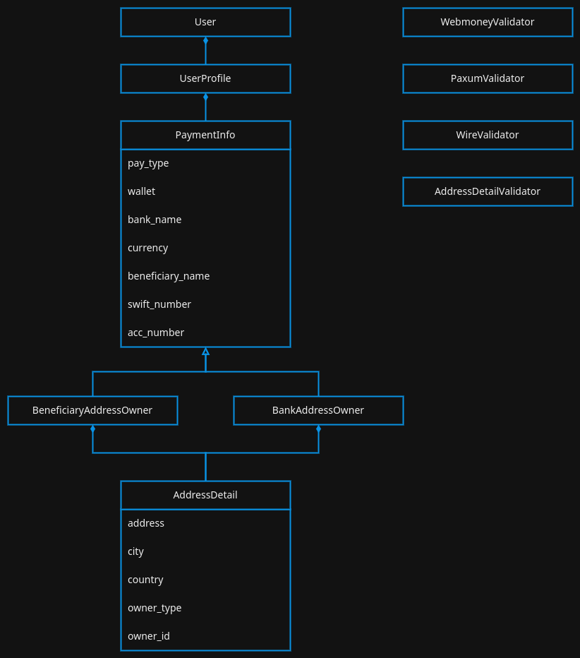
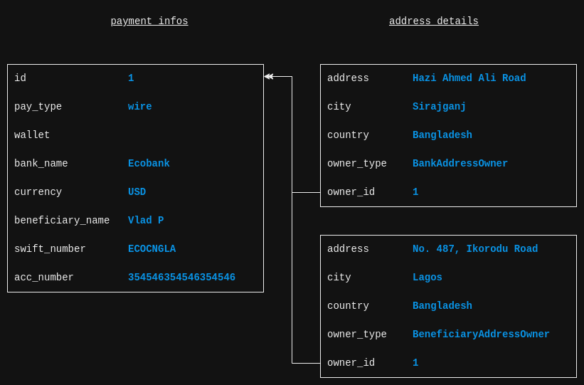
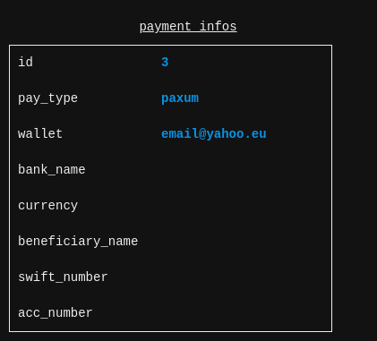
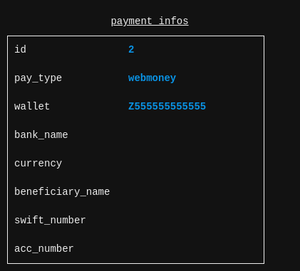

Class diagram:

The data example when user selects wire payout option. Address details are required. The app validates the data using `WireValidator`:

The data example when user selects Paxum payout option. The app validates the data using `PaxumValidator`:

The data example when user selects Webmoney payout option. The app validates the data using `WebmoneyValidator`:

